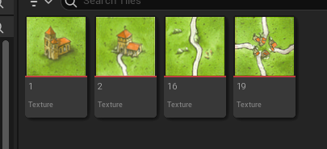
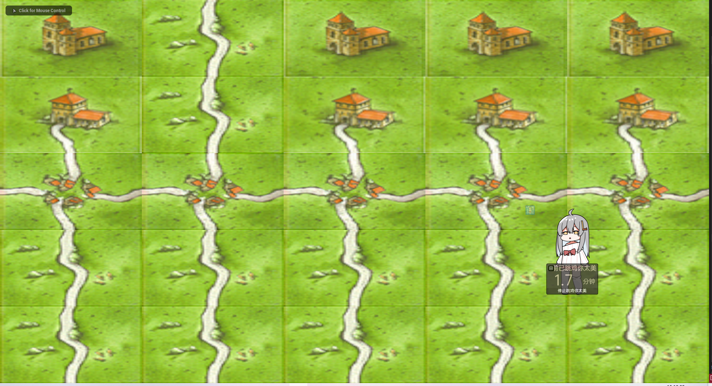
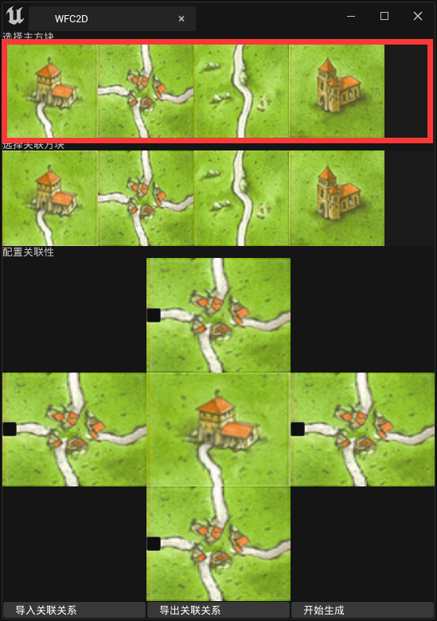
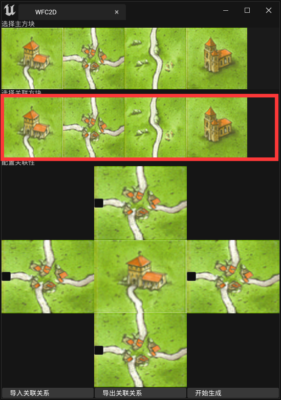
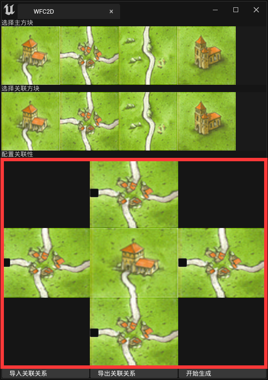
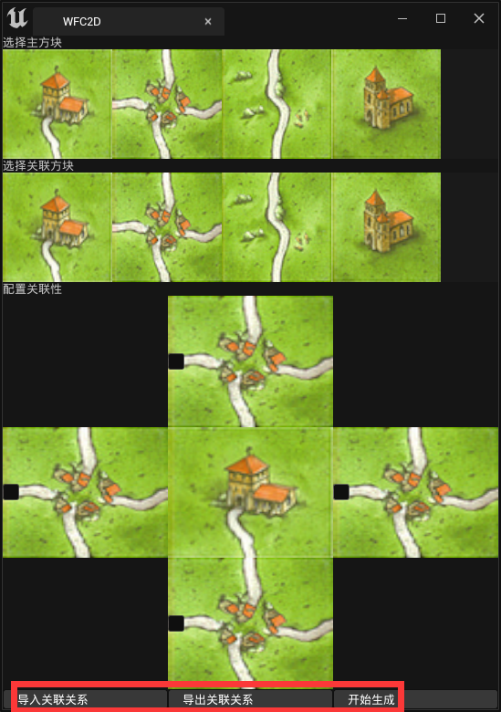

# WFC2D 插件

参考：[wfc2d](https://anseyuyin.github.io/wfc2D/demos/2DMapEditor/) 项目

基于 Unreal 实现的一个简单的测试Demo，并没有准备花太多心思处理，目的是为了组内分享WFC2D

预设的几个方块

最后生成出来的地图

## 代码解释

该插件分为两部分 Slate 和 核心算法

### 核心算法

- `UWFC2DHelper` 提供读取、导入、导出功能
  - `InitTiles` 将指定路径下的 `UTexture2D` 导入成 `UTile` 给 `Wfc2DEditorSubsystem` 提供原始数据
  - `ExportConnectConfig` 导出方块之间的关联关系为 JSON
  - `GenerationWfc2d` 生成地图并导出地图为 JSON
  - 其他一些方便外界调用的功能函数

- `WFCDConfig` 定义通用枚举 

- `UTile` 定义单一图片的 Tile，存储唯一ID、关联关系、文件路径等

- `Wfc2DEditorSubsystem`
  - `InitTiles` 初始化所有的图块并存储下来
  - `IsConnect` 根据 Tile 的 ID 判断两个 Tile 在指定方向上是否连接
  - `ConnectTile` 设置两个 Tile 在指定方向下连接
  - `DisconnectTile`设置两个 Tile 在指定方向下不连接
  - `GetConnectConfig` 输出 Tile 的关联关系，用于Debug
  - `GenerationWFC2D` 生成地图的接口

- `UWFC2DCalModel` 计算波函数坍塌的核心算法模块
  - `Run` 启动算法的入口函数，设定 Tile、地图的宽高，输出结果
  - `Collapse` 随机熵值最小的 Cell 进行坍塌
  - `Propagate` 根据坍塌之后的方块去影响相邻的方块，进而影响更外围的方块
  - `LogInfo` 输出每个 Cell 的信息，用于Debug

### Slate

Slate 相关界面启动的起点就是 `FWFC2DModule::OnSpawnPluginTab`

通过该函数会创建四个部分

1. 显示所有待选择主方块 => `STilesList`

2. 显示所有待选择连接方块 => `STilesList`

3. 设置主方块与关联方块的关联性 => `SSelectItemWidget`

4. 功能按钮 => `SButton`

## TODO 功能

1. 导入连接关系功能，目前并没有导入功能，导致每次关闭界面之后都需要重新设置 Tile 之间的连接关系，这样其实是非常浪费时间的，所以需要导入连接关系来节省事时间
2. 添加设置地图大小配置的 Slate 界面
3. 添加 Tile 贴图读取路径设置的按钮，类似import按钮一样点击可以选择文件夹
4. 添加 Tile 的连接设置方法，给每个 Tile 的边设置属性，自动这样可以自动连接 Tile 而不再需要手动设置，因为手动设置特别浪费时间而且容易出错，大概要设置 (1 + n) * n / 2 次。但是如果给每个 Tile 的边设置属性让其自动匹配，那么只需要设置 n 次即可

